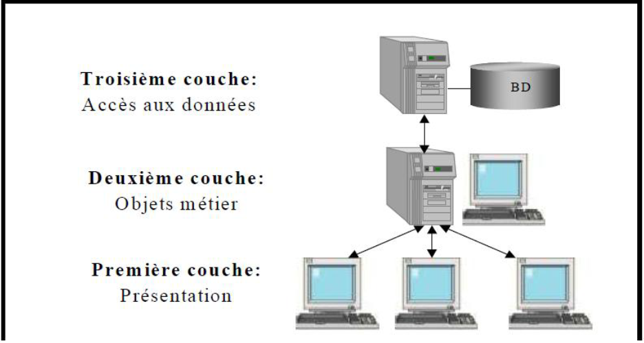
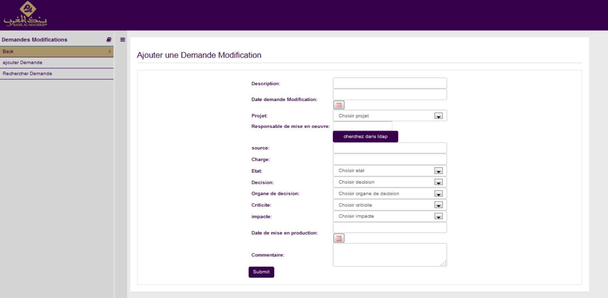
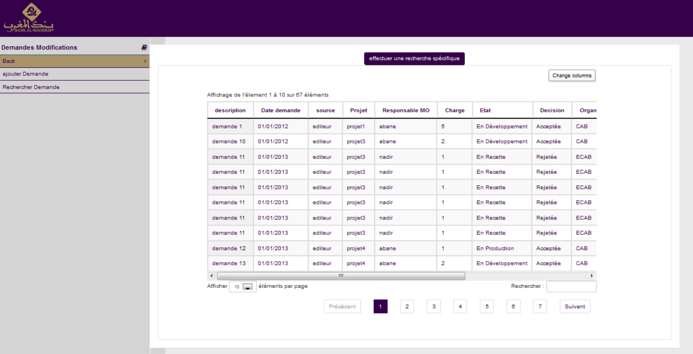

<h2>DESCRIPTION GÉNÉRAL DU PROJET</h2>
<h4>MISE EN PLACE D’UN SYSTEME POUR LA CENTRALISATION, LA GESTION ET LE SUIVI DES DEMANDES DE MODIFICATION DES PROJETS DE BANK AL-MAGHRIB</h4>

Cette étude concerne les modifications des projets de Bank Al-Maghreb, ces modifications ont pour objectif de modifier, créer ou supprimer un des composants de l'infrastructure du projet, donc un ou plusieurs éléments de configuration. Cette modification doit être réalisée dans le respect des méthodes, procédures et processus standardisés. Il est aussi nécessaire de planifier et approuver la faisabilité avant la mise en oeuvre. Il est aussi prévu de réaliser le suivi des modifications, ainsi que d'en informer les services impactés.

<h3>ARCHITECTURE DU PROJET</h3>
<h4>ARCHITECTURE CLIENT/SERVEUR A TROIS NIVEAUX</h4>

    Le projet a été conçu et réalisé selon une architecture C/S (Client/Serveur) à trois niveaux. Dans la présente annexe, j’ai décri cette architecture, et j’ai expliqué les avantages qu’elle offre par rapport aux autres architectures client/serveur.

    L’architecture C/S est une architecture qui permet de subdiviser un processus informatisé en, aux moins, deux tâches moins complexes (Client et Serveur) avec un moyen de communication qui permet à ces sous processus de coopérer entre eux.
    Il existe plusieurs variantes de l’architecture C/S. La première génération du C/S est l’architecture à deux niveaux ou 2-tiers. Elle a deux approches :

<ul>
    <li>Approche centrée sur le client : consiste à placer les parties présentation et traitement sur le client, et la logique d’accès aux données sur le serveur.</li>
    <li>Approche centrée sur le serveur : consiste à regrouper les parties traitement et accès aux données sur le serveur, et ne garder que la partie présentation sur le client.</li>
</ul>

    Ces deux approches de l’architecture C/S à 2-tiers peuvent provoquer des problèmes majeurs tels que :

<ul>
    <li>La charge de traitements considérable sur le client (première approche).</li>
    <li>La perturbation du trafic réseaux sur les jeux de résultats volumineux que peuvent générer les requêtes de la base de données (BD).</li>
    <li>L’absorption complète des ressources du serveur de données, car chaque session ouverte nécessite une connexion à la BD.</li>
    <li>La difficulté de la maintenance et de déploiement.</li>
</ul>

    Pour remédier aux limites de cette architecture, on a pensé à insérer un niveau supplémentaire, entre le client et le serveur, pour encapsuler les traitements métier de l’application. On a appelé ce type d’architecture, l’architecture C/S à trois niveaux ou 3-tiers.

<ul>
    <li>Couche présentation : représente l'interface Homme/Machine. Elle permet aux utilisateurs de dialoguer avec le système.</li>
    <li>Couche objets métier ou traitement : c’est une couche logicielle entre l’interface utilisateur et la base de données.</li>
</ul>

Ce niveau représente l'ensemble des fonctionnalités et des règles métier de l'application tels que les contrôles et la vérification du calcul qui s’exécutent au niveau du client.

<ul>
    <li>Couche accès aux données : constitue la base de cette architecture car elle offre tous les services nécessaires d’accès aux sources de données. Ces services seront utilisés par la couche d’objets métier ou traitement de cette architecture.</li>
</ul>

L’architecture C/S 3-tiers présente de nombreux avantages tels que :

<ul>
    <li>La facilité de maintenance et l’extensibilité : chacun de ces niveaux est implémenté indépendamment des deux autres, ce qui assure une autonomie des niveaux.</li>
</ul>

peut donc ajouter ou modifier dans le code de n'importe quel niveau sans affecter les autres.

<ul>
    <li>
        La réutilisation : les unités de code redondant utilisées dans plusieurs applications peuvent être rassemblées en des composants ou services. Cela favorise le développement rapide des applications.
    </li>
</ul>

    Ainsi, bien que les systèmes à deux niveaux aient leur place dans le monde des applications simples, les systèmes C/S à trois niveaux sont aujourd’hui considérés comme la solution idéale pour l’entreprise dont les besoins sont en évolution perpétuelle.

<h3>OUTILS ET FRAMEWORK</h3>
<h4>ORGANISATION DES FICHIERS MAVEN :</h4>

    propose une structure de fichier complète. Il s'agit de la configuration par défaut mais elle est surchargeable.

    Le principe général est de limiter le répertoire racine du projet à trois éléments : le fichier de description du projet pom.xml, le répertoire src qui contient uniquement les sources du projet et le répertoire target qui contient tous les éléments créé par Maven.

<table>
    <thead>
      <tr>
        <th>Répertoire</th>
        <th>Description</th>
      </tr>
    </thead>
    <tbody>
      <tr>
        <td>src/main/java</td>
        <td>Contient les sources Java de l'application</td>
      </tr>
      <tr>
        <td>src/main/resources</td>
        <td>Contient les ressources de l'application</td>
      </tr>
      <tr>
        <td>src/test/java</td>
        <td>Contient les sources Java pour les tests unitaires</td>
      </tr>
      <tr>
        <td>src/test/resources</td>
        <td>Contient les ressources pour les tests unitaires</td>
      </tr>
      <tr>
        <td>src/site</td>
        <td>Contient les fichiers pour le site</td>
      </tr>
      <tr>
        <td>target</td>
        <td>Répertoire de destination de tous les traitements Maven</td>
      </tr>
    </tbody>
  </table>
<h3>CONCEPTION DES IHM (INTERFACE HOMME MACHINE)</h3>   

    Je présente deux interfaces:

<h4>INTERFACE D’AJOUTER UNE DEMANDE DE MODIFICATION</h4>

L’interface d’ajouter permet à l’utilisateur d’ajouter les informations du demande. Après la vérification des données saisies, le système enregistre les informations à la base de données du système.

Lorsque l’utilisateur clique sur ajouter une demande, il va rediriger sur cette page de saisi d’une demande, et il lui est demandé de saisir toute une série d’informations qui doivent être obligatoirement saisies ou pas, j’utilise des listes déroulantes et des textboxs pour le formulaire,

Le programme vérifie si la saisie de chacun d’entre eux est correcte, avant d’ajouter la demande et ses caractéristiques dans la base de données.

<h4>INTERFACE DE RECHERCHE D’UNE DEMANDE DE MODIFICATION</h4>

L’interface de recherche permet à l’utilisateur d’afficher les informations des demandes et la vérification des données saisies sur les demandes.

Cette fiche affiche plusieurs critères du demande en cliquent sur l'icône « charger le contenue » qui permet de détails les infos sur la demande choisi.

